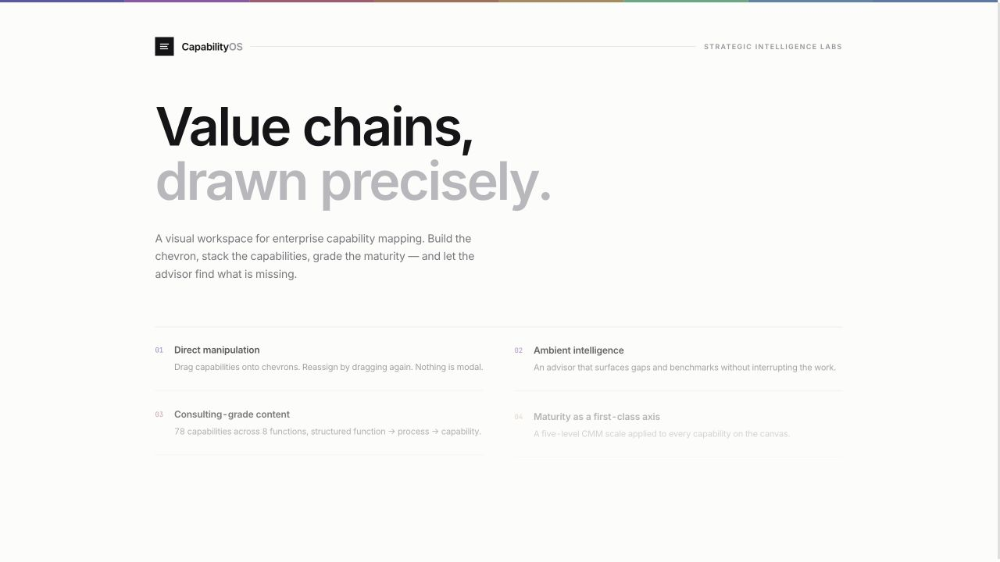
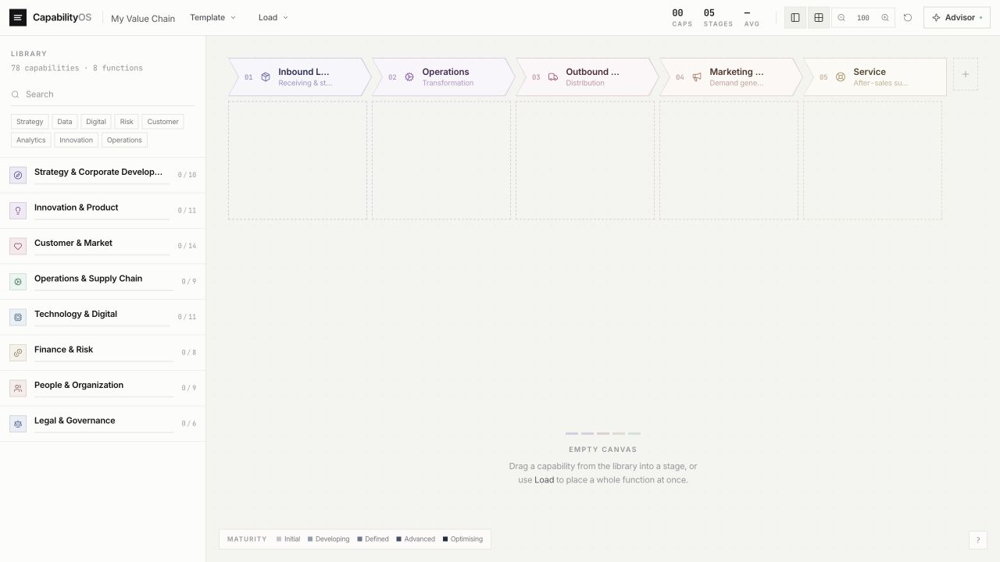
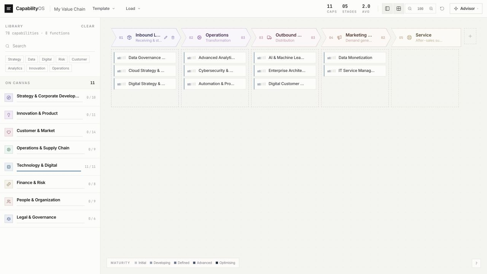
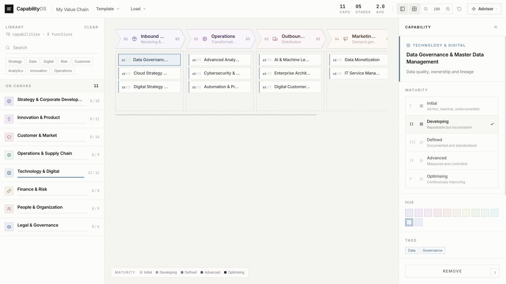
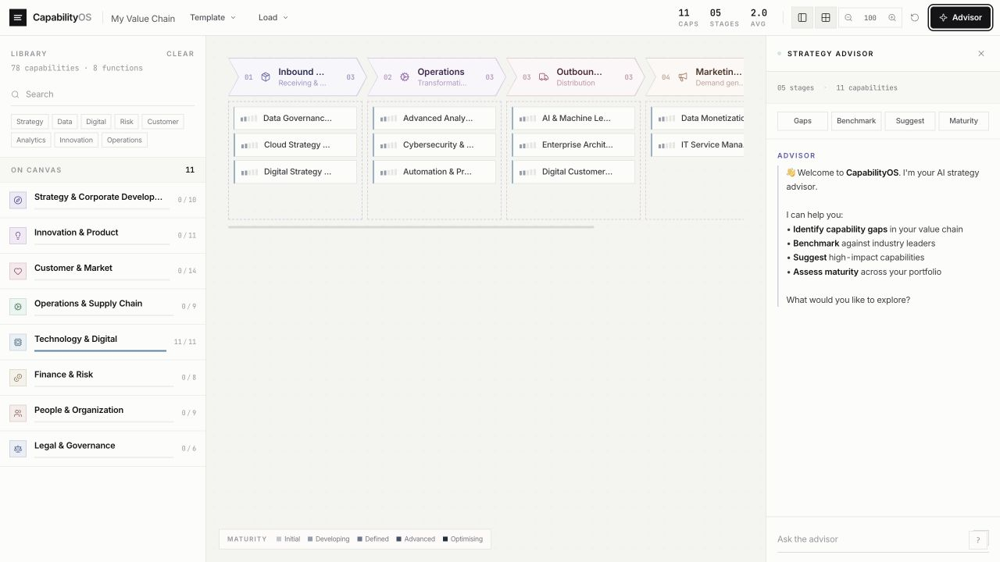
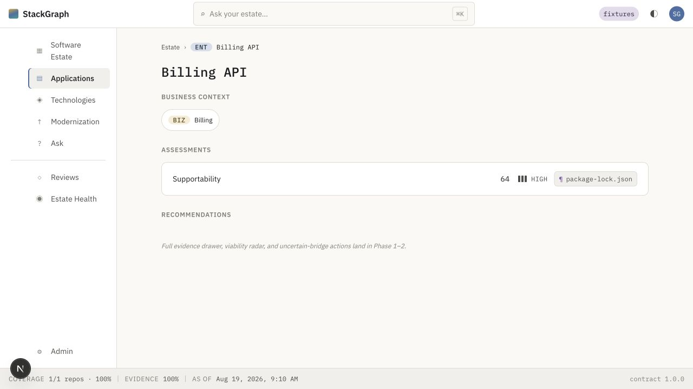

# Visual business capability mapper integration review

Date: 2026-08-19

## Outcome

Integrate the mapper as a first-class **Business Map** workspace inside StackGraph. Preserve the library → value-chain canvas → capability detail interaction model. Do not embed the prototype wholesale and do not reduce it to a static graph.

The prototype is a strong front-end concept and a good starter catalog, but it is not yet a StackGraph feature. Its durable value is the interaction model, information architecture, and catalog content. Its transient parts are the standalone shell, in-memory state, styling implementation, simulated advisor, and mouse-only drag behavior.

## Reuse estimate

The sample contains 3,062 lines across React, TypeScript, and CSS, plus 78 capabilities, 19 business processes, 8 business functions, and 4 value-chain templates.

| Area | Recommendation | Estimated reuse |
| --- | --- | ---: |
| Capability catalog and template content | Migrate into a versioned business taxonomy seed; retain names, descriptions, tags, KPIs, and hierarchy after editorial review | 80–90% of content |
| Library, canvas, cards, detail panel | Port component structure and interaction logic into a new StackGraph feature package; restyle with Strata tokens | 60–70% of component structure |
| Selection, zoom, panel, maturity, add/remove actions | Keep the local interaction model, but separate server state from ephemeral UI state | 45–60% of store logic |
| Toolbar and quick load | Retain the task controls, but place them below StackGraph's global top bar and remove duplicate product chrome | 40–50% |
| Theme, global CSS, standalone app shell, welcome screen | Replace with StackGraph shell, design tokens, CSS modules, and contextual first-run help | 10–20% |
| Advisor | Reuse the panel layout and quick prompts only; replace all response logic with evidence-backed Ask Your Estate behavior | 15–25% |

Overall, about **55–65% of the visible product behavior** can be preserved, while about **35–45% needs deliberate rebuilding**. Direct copy/paste reuse will be lower because StackGraph uses its own tokens, contracts, shell, and evidence model.

## Captured flow

### 1. Welcome and concept framing — healthy, but standalone-only

The value proposition is unusually clear: direct manipulation, ambient intelligence, a structured catalog, and maturity assessment. The standalone CapabilityOS branding and full-screen welcome should not ship inside StackGraph. Convert this into a compact first-run empty state or help drawer.

### 2. Empty canvas and catalog entry — healthy

The three-region work surface is the right model: searchable catalog on the left, value-chain canvas in the center, contextual controls on the right. The empty state is calm and instructive. It should become a full-bleed route inside the existing AppShell rather than a page constrained to the normal 900px content column.

### 3. Function hydration and capability distribution — visually strong, semantically unsafe

Loading an entire business function is an excellent onboarding shortcut. The current implementation distributes capabilities across stages by array position, however, not by a semantic relationship. This must become an explicit, reviewable proposal based on `BusinessProcess REQUIRES BusinessCapability` and value-chain mappings, with provenance and confidence.

### 4. Capability detail and maturity — strong interaction, incomplete data model

The side panel keeps the user in context and makes maturity tangible. Retain this interaction. Replace free-form hue editing with StackGraph domain/status semantics, and model maturity as an assessment with as-of date, source, confidence, owner, and evidence rather than a bare integer.

### 5. Advisor in context — good placement, prototype-only behavior

The advisor belongs beside the canvas and its four quick prompts are useful. The current hard-coded benchmark and performance claims cannot ship in an evidence-first product. The panel should call the same reasoning and citation pipeline as Ask Your Estate, scoped to the current value chain and selection. Suggestions should appear as proposed graph mutations with Accept, Edit, and Reject actions.

### 6. Existing StackGraph business context — healthy foundation, missing workspace

StackGraph already has the correct business namespace, visual badge, ontology, and application-level business context. What is missing is the authoring and review workspace that creates and maintains those relationships. The mapper fills that gap cleanly.

## Recommended product shape

Add **Business Map** as a primary StackGraph route, immediately after Software Estate. The route should use the existing global top bar, left navigation rail, status strip, theme system, and evidence drawer.

Inside the route:

1. A route-local command bar contains map title, template, import/load, coverage metrics, zoom, and advisor toggle.
2. A 264px capability library provides function → process → capability browsing, search, filters, completion counts, and load-as-proposal.
3. The center is a full-bleed value-chain canvas with editable stages, sortable capability cards, zoom, and an unassigned pool.
4. One contextual right panel is open at a time: capability detail, stage detail, or advisor. On narrower screens it becomes a drawer.
5. Application and technology pages link back to the relevant capability on the Business Map. Selecting a capability can open a bounded cross-domain Graph Explore neighborhood.

Do not place the existing StackGraph global left rail and the capability library at the same visual hierarchy. The rail remains navigation; the library is a route-local work panel with a different background and narrower typography.

## Data model and API work

The existing ontology already defines:

`Organization → BusinessUnit → ValueChain → BusinessFunction → BusinessProcess → BusinessCapability`

The feature needs durable contracts for:

- `BusinessMapDetail`: value chain, ordered stages, functions, processes, capabilities, placements, and revision metadata.
- `CapabilityAssessment`: maturity level, assessment method, owner, observed/effective dates, confidence, rationale, and citations.
- `BusinessMapMutation`: add, move, reorder, edit, archive, and restore operations with optimistic concurrency.
- `CapabilityProposal`: proposed node/edge mutations, source prompt/model/taxonomy version, evidence, confidence, counter-signals, and review state.
- `CatalogVersion`: stable canonical keys and aliases for imported starter content.

The sample catalog should be transformed into versioned seed records. Replace `cap-1`-style identifiers with stable canonical keys. Preserve user-specific maps as tenant-owned graph data; never mutate the shared starter catalog when a user renames or grades a capability.

For process pre-fills, create explicit mappings such as:

`ValueChainStage CONTAINS BusinessFunction`

`BusinessFunction CONTAINS BusinessProcess`

`BusinessProcess REQUIRES BusinessCapability`

AI-generated value chains should produce proposals against those relationships, not directly write the graph.

## Highest-impact technical changes

1. Split state into server-backed business-map data and a small Zustand UI store for selection, panel visibility, zoom, and draft drag state.
2. Replace HTML5 `draggable` with accessible sensors or equivalent keyboard commands. A user must be able to select a capability and move it to a named stage without dragging.
3. Replace Tailwind/global prototype CSS with CSS modules and Strata tokens. Keep the prototype's density and hairline visual character, but use the Business amber ramp for business-domain identity and Intelligence violet for AI proposals.
4. Remove standalone branding, the full-screen welcome, free-form color controls, and the prototype's fake benchmark responses.
5. Add persistence, autosave status, revision/conflict handling, and undo/redo before treating the canvas as an authoring tool.
6. Make template switching an explicit migration operation. The sample replaces stage IDs without remapping existing placements, which can orphan capabilities.
7. Replace positional prefill distribution with semantic stage mappings and a visible review step.

## Accessibility and responsive risks

- Capability cards are draggable `div` elements without keyboard focus or an equivalent move command.
- Many icon-only controls have no accessible name in the rendered DOM.
- Maturity ticks are only a few pixels wide and do not meet practical pointer target guidance.
- Numerous labels render at 8.5–10.5px with very muted contrast; this is too small for a core enterprise workflow.
- Prototype motion does not provide a reduced-motion path, while StackGraph already enforces one globally.
- Fixed-width panels and the desktop HTML drag model do not provide a viable small-screen flow.
- Hover-only edit/remove affordances are not available to touch or keyboard users.

StackGraph's existing focus treatment, reduced-motion rule, responsive rail, and semantic design-system components provide the right baseline. The mapper should inherit them rather than maintain a second accessibility layer.

## Suggested implementation sequence

1. **Foundation:** add canonical catalog seed and business-map read/write contracts.
2. **UI sliver:** add the Business Map route, full-bleed workspace override, library, canvas, capability cards, detail panel, templates, local selection, and fixture-backed persistence.
3. **Interaction hardening:** accessible move/reorder behavior, undo/redo, autosave, responsive panels, and dark theme.
4. **Graph integration:** connect application/service relationships, evidence, Graph Explore entry points, and business-context backlinks.
5. **AI proposals:** scope Ask Your Estate to the map and add cited, reviewable value-chain/capability proposals.

## Verification performed

- The mapper production build completed successfully with Vite.
- StackGraph's web workspace passed TypeScript checking.
- The mapper welcome, empty state, function load, capability detail, and advisor flow were exercised in the browser.
- The current StackGraph Software Estate and application business-context screens were rendered for visual comparison.

Screenshot evidence cannot prove keyboard support, screen-reader output, touch behavior, contrast ratios, persistence safety, or production AI accuracy; those require implementation-level tests.
