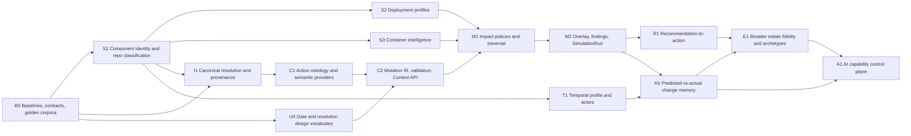

# StackGraph Phase 2 Integrated Implementation Plan

**Status:** backend primary vertical slice implemented; UI delivery and later safety-gated expansion remain in progress
**Baseline:** `origin/main` at `1328bf8` on 2026-09-05
**Primary vertical slice:** `UPGRADE Package`
**North star:** Discover → Understand → Recommend → Compile → Simulate → Govern → Execute → Verify → Learn

## 1. Purpose and source-of-truth rules

This document consolidates the Phase 2 product plan and scanner-improvements plan into one ordered delivery program. It adds the missing dependency model, measurable service levels, release gates, and mappings to the repository as it exists today.

The detailed source specifications remain normative and are retained verbatim:

- [`phase-2-plan.md`](phase-2-plan.md): product thesis, action grammar, Mutation IR, change simulation, change memory, estate fidelity, and AI control plane.
- [`scanner-improvements.md`](scanner-improvements.md): repository classification, component decomposition, container and deployment intelligence, temporal evidence, change-actor provenance, repository fingerprints, and architecture archetypes.
- [`../ui-recommendations.md`](../ui-recommendations.md), Part II: the aligned UI contract, blocking-state vocabulary, evidence rendering, and Phase 2A–2F UI sequence.
- [`operations-slo.md`](operations-slo.md): existing production queue, projection, webhook, freshness, and incident thresholds.

No requirement in those documents is cancelled by summarization here. This plan controls sequencing, dependencies, acceptance, and SLAs. The source documents control detailed product intent. If a real conflict appears during implementation, record an ADR and update both the source document and this traceability map in the same change.

## 2. Product outcome and non-negotiable boundaries

StackGraph becomes a semantic control plane for enterprise change:

> Free-form intent. Constrained semantics. Deterministic execution.

The product must:

1. derive valid actions from the observed estate and a bounded, versioned action ontology;
2. resolve every subject and target to canonical identity or explicitly refuse to proceed;
3. compile all entry points—command bar, recommendation, PR/change set, ticket, architecture change, agent proposal, or API—into the same Mutation IR;
4. simulate a virtual before/after estate using predicate-aware impact policies, not generic N-hop traversal;
5. keep deterministic findings, evidence, and policy decisions structurally separate from AI interpretation;
6. express technical impact in application, service, deployment, business-capability, criticality, and policy terms;
7. verify actual outcomes and retain organizational change memory;
8. use the scanner as the evidence-producing sensory layer for structure, packaging, deployment, operation, and change behavior.

The product must not become a generic chatbot, generic RAG system, code search engine, observability platform, vulnerability database, CMDB, standalone lineage product, agent framework, or workflow engine. Integrate those specialist systems and normalize their evidence into StackGraph.

## 3. Current-state assessment: extend, do not rebuild

The original plans describe several capabilities that now exist partially on `main`. Implementation must begin with a measured gap audit rather than parallel replacements.

| Area | Existing baseline | Remaining Phase 2 delta |
| --- | --- | --- |
| Canonical data | PostgreSQL entities, identities, aliases, assertions, evidence, temporal facts, RLS | Resolution API with explicit `RESOLVED` / `INFERRED` / `UNRESOLVED`, safety thresholds, reconciliation workflow, and simulation eligibility |
| Graph | AGE projection, governed graph policies/runs, impact paths, SQL fallback | Mutation-specific `ImpactPolicy`, deterministic classification (`DIRECT`, `TRANSITIVE`, `CONTEXT`, `STOP`, `INFORMATIONAL`), hypothetical overlay, and simulation snapshot/versioning |
| Scanner | v1.10 dependency/usage, code units, repository profile, app/service boundaries, Docker/Compose/Kubernetes/Terraform, database/storage signals, evidence and bounded partial results | First-class component entities, multi-label repo classification, provider/workload deployment profiles, digest-first container composition, richer temporal and actor signals, fingerprints, archetypes |
| Activity | GitHub activity collection/events and repository activity API | Releases, deployments, dependency/architecture changes, incidents/rollbacks, richer PR metrics, actor taxonomy and outcome correlation |
| Recommendations | Deterministic insights and modernization recommendations | Proposed ChangeSet on every actionable recommendation and standard `Simulate` action |
| Business context | Capability taxonomy/mapping and persisted Business Maps | Stable change-impact joins through component → service/application → capability/process → criticality/obligation, with provenance |
| AI | Provider-neutral governed AI services and invocation records | Explanation strictly downstream of findings; citations to finding IDs; capability envelopes and cross-system flight recording later |
| UI | Evidence-first read models, confidence/citation vocabulary, graph/canvas, current UI review | Gate vocabulary, resolution states, command bar, simulation surfaces, change brief, contradiction ledger, change-memory and control-plane surfaces |
| Operations | Queue/lease/dead-letter/freshness/projection alerts, recovery drill, 100-repository pilot, bundle budget | Simulation and scanner performance benchmarks, error budgets, idempotency/replay drills, calibration and provenance coverage dashboards |

## 4. Target architecture and data ownership

```text
Revision-pinned repository + connector evidence
                    ↓
        Scanner facts and activity events
                    ↓
 PostgreSQL authoritative temporal estate + evidence
                    ↓ transactional outbox
       AGE/Neo4j disposable read projection
                    ↓
 Identity resolver + semantic/action providers
                    ↓
       validated Mutation / ChangeSet IR
                    ↓
 versioned ImpactPolicy + virtual graph overlay
                    ↓
 immutable SimulationRun + Findings + EvidenceRefs
                    ↓
 deterministic gate verdict ─── AI interpretation
                    ↓                     ↓
       Change Brief / API / UI, visibly partitioned
                    ↓
     execution observation + actual outcome
                    ↓
              Change memory
```

Architecture rules:

- PostgreSQL remains authoritative; graph stores are rebuildable projections and must not accept business-authoritative writes.
- Raw source artifacts are content-addressed and revision-pinned. Partial scans never assert absence or close previously complete state.
- High-volume history belongs in the activity/event store with query aggregates; do not make every commit a permanent heavyweight graph node.
- Contracts land before producers and consumers. Canonical OpenAPI and generated TypeScript remain drift-gated.
- Mutation, ChangeSet, policies, SimulationRun, findings, and outcomes are immutable after terminal publication. Supersession creates a new version.
- Every decision records tenant, input fingerprint, estate/projection watermark, policy versions, scanner/extractor versions, evidence IDs, actor, and timestamps.
- AI may interpret intent above a draft Mutation and explain results after deterministic findings. It may not resolve a low-confidence entity silently, choose impact paths, manufacture findings, or override a gate.
- User-curated facts remain distinct from scanner observations and survive rescans; provenance and temporal validity decide the effective view.

## 5. Dependency graph and critical path



The production critical path is `B0 → S1/I1/U0 → C1 → C2 → M1 → M2 → R1`. Scanner temporal work can proceed after stable component identity and must be complete before change-memory claims. AI control-plane execution is blocked until simulation quality and calibration gates pass.

## 6. Work packages

### B0 — Baseline, contract, and evaluation foundation

**Depends on:** none.
**Blocks:** every other package.

Deliver:

- benchmark the current scanner against a versioned corpus covering single apps, libraries, monorepos, containerized services, Kubernetes/Terraform, serverless apps, data repos, malformed input, generated/vendor trees, and large bounded repos;
- record current precision/recall, scan p50/p95/p99, peak memory, fact volume, ingestion/projection lag, read latency, and bundle size;
- define stable fixture IDs and expected facts for the initial `UPGRADE Package` scenario;
- decide scanner contract evolution (`1.x` additive or `2.0` breaking) and document compatibility/deprecation policy;
- add ADRs for Mutation IR, simulation persistence/immutability, graph overlay, policy versioning, and history retention;
- add feature flags for scanner profiles, compiler, simulation, AI interpretation, and each execution-capable surface;
- convert every SLA in §9 into an executable benchmark, test, metric, dashboard, or alert before its dependent feature is considered done.

Exit gate: reproducible baseline artifact, signed contract/ADR set, and CI jobs that can fail on correctness or material performance regression.

### S1 — Component decomposition and multi-label repository classification

**Depends on:** B0.
**Blocks:** precise identity, deployment/container attribution, compiler scope, and simulator MVP.

Deliver:

- promote manifest/workspace paths from repository-profile strings to canonical `Component` entities;
- emit `Repository CONTAINS Component` with path, component kind, independent deployability, language, framework, ecosystem, build system, runtime, entry points, tests, ownership, APIs, and data dependencies where evidence exists;
- support multiple repository classifications: monorepo, full-stack app, microservice, library/package, CLI, IaC, data/analytics, Databricks, Fabric, dbt, ML, notebooks, SQL/schema migration, API definition, docs, mobile, serverless, platform, GitOps, and deployment-only;
- separate declared/observed classifications from inferred ones and attach rule version, confidence, limitations, evidence, and source revision;
- guarantee stable component keys across rescans and deterministic rename/split/merge handling without silently changing identity;
- update ontology, schemas, fixtures, ingestion, projection, API read models, repository detail, and graph views together.

Exit gate: in monorepo fixtures, an impact can identify `apps/payment-api` without falsely including `apps/customer-ui`; all facts replay idempotently and remain evidence-linked.

### S2 — Deployment profiles and infrastructure topology

**Depends on:** S1.
**Blocks:** deployment-aware impact and architecture archetypes; required for simulator production release, though not for compiler-only demo.

Deliver:

- introduce a versioned deployment-profile record/entity with provider, workload, environment/scope when observed, resources, confidence, limitations, and evidence;
- detect at least Vercel, Supabase, AWS, GCP, Azure, Databricks, Microsoft Fabric, Docker Compose, Kubernetes, and serverless/IaC patterns through pluggable detectors;
- model capabilities with typed edges such as `DEPLOYS_TO`, `USES`, `STORES_DATA_IN`, and `RUNS_JOBS_ON`, avoiding a lossy single `hosted_on` tag;
- preserve the difference between declared deployment configuration and verified live deployment; corroborate via connectors/telemetry when available;
- create contradiction facts when repository, runtime, documentation, and policy sources disagree rather than selecting truth implicitly.

Exit gate: representative fixtures produce stable, provider-specific profiles; no code-only signal is displayed as a verified live deployment.

### S3 — Digest-first container and runtime composition

**Depends on:** S1 and registry/provider adapter contracts.
**Blocks:** base-image/package blast radius and production-grade package simulation.

Deliver:

- model `Component BUILDS ContainerImage`, `Service DEPLOYED_AS ContainerImage`, and `ContainerImage BASED_ON BaseImage`;
- resolve immutable digest where registry access permits; retain mutable tag as an observation, never as canonical identity;
- capture registry, architecture, OS, base layers, OS packages, language runtimes, application packages, ports, entry point, user, and provenance with explicit coverage states;
- parse multi-stage Dockerfiles, Compose, Kubernetes, build matrices, and image references without leaking credentials or executing repository code;
- make registry/network enrichment asynchronous, cached, rate-limited, allowlisted, and non-blocking for deterministic local scanning;
- connect OS/runtime/package findings to lifecycle and vulnerability providers rather than building those databases.

Exit gate: a base-image or transitive package change reaches only images/components actually backed by evidence, and unresolved tags are visibly limited.

### T1 — Temporal profile, PR intelligence, and change actors

**Depends on:** S1 and existing GitHub activity tables/API.
**Blocks:** Phase 2D change memory; does not block first compiler/simulator demo.

Deliver:

- extend activity beyond commits and merged/opened PRs to releases, deployments, dependency changes, architecture changes, incidents, interventions, and rollbacks through connector-specific adapters;
- compute versioned windowed aggregates: age, commits/PRs/contributors, velocity, deployment frequency, dependency change rate, refactors, ownership concentration, hotspots, stability, time-to-merge, review depth/count, change size, revert rate, failed builds, dependency/automated PR rate, and test posture;
- store raw bounded events plus recomputable aggregates, coverage statuses, limitations, and retention class;
- use actor taxonomy `HUMAN`, `BOT`, `DEPENDENCY_BOT`, `CI_AUTOMATION`, `AI_AGENT`, `AI_ASSISTED_HUMAN`, `UNKNOWN`;
- claim AI assistance only from authoritative metadata as high confidence; heuristic signals remain explicitly low confidence and never support individual performance judgments;
- aggregate sensitive contributor information, enforce least privilege and retention/deletion, and document intended governance uses.

Exit gate: temporal risk distinguishes active/well-tested and dormant/unknown services without presenting missing data as poor performance.

### S4 — Repository fingerprint and architecture archetypes

**Depends on:** S1–S3 and T1.
**Blocks:** final Phase 2E recommendations, not initial simulator.

Deliver:

- produce a versioned `RepositoryFingerprint` covering identity, structure, components, language mix, frameworks, data, containers, deployment, architecture, activity, actor mix, lifecycle, confidence, limitations, and evidence links;
- expose fingerprint history so users can inspect how a repository evolved;
- infer explainable architecture archetypes only after lower-level facts meet coverage thresholds;
- support standard-archetype, near-match, and anomalous/bespoke classifications with feature contributions and evidence;
- feed fingerprint features into recommendations and simulation risk without allowing a derived archetype to override direct facts.

Exit gate: archetype assignments are reproducible, explainable, versioned, and evaluable against a reviewed corpus.

### I1 — Canonical identity, resolution, and relationship provenance

**Depends on:** B0; consumes S1 when available.
**Blocks:** all safe compilation and simulation.

Deliver:

- enforce stable IDs for every simulatable Package, Runtime, Framework, API, Database, Service, Component, ContainerImage, and Deployment;
- follow resolution order: authoritative external ID → exact canonical identifier → known alias → structural match → semantic candidate → LLM-assisted candidate generation;
- return explicit `RESOLVED`, `INFERRED`, or `UNRESOLVED`, candidate list, confidence, method/version, and evidence; material inferred/unresolved inputs cannot compile silently;
- surface duplicates and reconciliation in the existing human-review model;
- make every simulation-relevant edge answer why, where, when, confidence, and corroborating evidence; compute corroboration depth without conflating source count with truth;
- define expiry/staleness and contradiction behavior for every source class.

Exit gate: canonical entity precision >99% on the golden corpus, 100% of ambiguities are surfaced end-to-end, and silent unresolved guesses are zero.

### C1 — Bounded action ontology and semantic providers

**Depends on:** I1.
**Blocks:** Mutation compilation.

Deliver:

- version action predicates `UPGRADE`, `REPLACE`, `REMOVE`, `DEPRECATE`, `MIGRATE`, and `MOVE`;
- support subjects Package, Runtime, Framework, API, Database, and Service; add Component/Container only through an explicit ontology revision;
- persist `ActionCapability` with subject type, predicate, target schema, validation rules, semantic provider, scope rules, and lifecycle;
- derive legal verbs from ontology, valid target states from authoritative/pluggable ecosystem providers, and scope from the estate;
- include observed versions, version ranges, constraints, supported versions, compatibility, organizational standards, lifecycle/support, migration paths, and provider freshness;
- reject broad `CHANGE`, `IMPROVE`, and `TRANSFORM` until deterministic semantics exist.

Exit gate: the system enumerates all legal subject/action/target/scope combinations without using an LLM to invent candidates.

### C2 — Mutation IR, ChangeSet, Context API, and command surface

**Depends on:** C1, I1, and U0.
**Blocks:** simulation.

Deliver:

- define immutable, versioned `Mutation` fields: ID, predicate, canonical subject, before, after, scope, constraints, provenance, and input fingerprint;
- define ordered/atomicity-aware ChangeSets, conflict detection, validation errors, idempotency key, and lifecycle (`DRAFT`, `VALIDATED`, `REJECTED`, `SUPERSEDED`, `SUBMITTED`, `EXECUTED`, `CANCELLED` as applicable);
- normalize all seven entry points to Mutation IR; deterministic engines never consume natural language directly;
- implement `GET /action-types`, `GET /action-types/{predicate}/subjects`, `GET /entities/{id}/valid-targets`, `GET /entities/{id}/scopes`, `POST /mutations/compile`, and `POST /mutations/validate` with pagination, freshness, policy version, and machine-readable refusal reasons;
- implement command states `EMPTY`, `RESOLVING`, `TOKENISED`, `COMPILED`; resolved tokens carry canonical IDs and estate-backed suggestions only;
- display target versions with the version-spread comb, and block with named evidence when identity, contradiction, target, scope, or policy is unresolved.

Exit gate: `UPGRADE Package` compiles to a validated Mutation or is refused deterministically; invalid “tree” input never reaches simulation.

### U0 — Safety vocabulary and shared UI primitives

**Depends on:** B0.
**Blocks:** C2 UI and every change-capable surface.

Deliver:

- add resolution vocabulary separate from confidence;
- add gate component and states `BLOCKED`, `ESCALATE`, `CONSTRAIN`, `CLEAR`; the first three name the reason/evidence and are never dismissible, while `CLEAR` renders no surface;
- reserve filled surfaces for `BLOCKED`/`ESCALATE`; keep advisory tones semantically distinct;
- encode domain by hue, confidence by segments, resolution by typography/glyph, impact class by position, gate by filled surface, entropy by the one sequential ramp, and before/after by solid/hatched pattern;
- add glossary, keyboard, screen-reader, focus-management, reduced-motion, contrast, and text-equivalent coverage.

Exit gate: no component can make inferred identity appear resolved, no blocking reason exists only in a tooltip/color, and automated axe plus keyboard journeys pass.

### M1 — Versioned impact policies and predicate-aware traversal

**Depends on:** C2, I1, and the S1–S3 facts required by the selected vertical slice.
**Blocks:** M2.

Deliver:

- persist `ImpactPolicy` by entity type + predicate with edge type, direction, max depth, weight, stop condition, classification, confidence/provenance thresholds, and version;
- classify paths and findings as `DIRECT`, `TRANSITIVE`, `CONTEXT`, `STOP`, or `INFORMATIONAL`;
- use different policies for package upgrade, API deprecation/removal, runtime/framework change, database migration, and service move;
- record deliberately stopped branches and reasons; generic N-hop endpoints cannot masquerade as impact simulation;
- traverse only canonical/confirmed entities and eligible temporal facts as dictated by policy;
- pin graph watermark and fall back safely to bounded SQL or an explicit `NOT_SIMULATABLE` state when projection is stale/unavailable.

Exit gate: repeated traversal over the same snapshot/policy is byte-for-byte deterministic, tenant-isolated, bounded, and evidence-reconstructable.

### M2 — Hypothetical estate overlay, SimulationRun, findings, and explanation

**Depends on:** M1.
**Blocks:** R1 and H1.

Deliver:

- model `G' = G + Δ` as an in-memory/query overlay or delta, never a full graph clone;
- evaluate introduced/resolved invalid dependencies, policy violations, compatibility failures, lifecycle changes, vulnerabilities, contradictions, and newly satisfied standards;
- persist immutable SimulationRun inputs, watermarks, policy/provider/scanner versions, status, timings, resource use, findings, impact paths, evidence refs, limitations, and failure detail;
- make submission asynchronous and idempotent; expose `POST /simulations` and `GET /simulations/{id}` with cancellation/retry rules and stable terminal results;
- findings include fact, evidence, rule/version, confidence, provenance, classification, and affected entity; AI interpretation includes risk, explanation, rollout, remediation, and verification, each citing finding IDs;
- allow deterministic results to succeed when AI is unavailable; flag any uncited AI claim rather than blending or silently hiding it;
- implement the findings/interpretation partition, classification ring with STOP boundaries, attenuation funnel, simulated heat grid (`Now`, `Simulated`, `Difference`), and printable Change Brief.

Exit gate: the package-upgrade slice runs end-to-end; every material impact traces to evidence; deterministic output remains available and unchanged with AI disabled.

### R1 — Recommendation-to-action loop

**Depends on:** M2 and existing deterministic/modernization recommendations.
**Blocks:** complete Phase 2C loop.

Deliver:

- extend recommendation schemas with optional proposed ChangeSet, proposal provenance, and current validation state;
- add `Simulate recommendation` consistently to home suggested changes, modernization, insight cards, application findings, and review queue;
- never require users to re-enter a recommendation that StackGraph can compile;
- surface API retirement, version fragmentation, unsupported runtimes, security findings, architecture-policy violations, and pending changes only when a valid proposal can be produced or a precise `NOT_SIMULATABLE` reason can be shown;
- render the Change Brief with mutation tokens, gate, findings, interpretation, impact, historical evidence when available, verification plan, as-of time, and policy versions.

Exit gate: a user moves from an estate-backed finding to a submitted simulation without manual re-entry or loss of provenance.

### H1 — Observed changes and predicted-vs-actual memory

**Depends on:** M2 and T1.
**Blocks:** evidence-based historical risk and A1.

Deliver:

- persist `ObservedMutation`: predicate, subject, before/after, scope, observed/unexpected impact, success, intervention, rollback, evidence, and correlation keys;
- correlate PRs/commits, dependency changes, deployments, tickets, incidents, rollbacks, and postmortems while preserving source uncertainty;
- record graph state/watermark before, predicted impact, execution observation, actual impact, and resolution;
- retrieve similar changes using deterministic filters first and evaluated semantic/structural ranking second;
- compute historical predictors only above documented sample/quality thresholds and publish sample size, confidence, bias/coverage limitations, and calibration;
- show change history, prior outcomes, predictors, drift timeline, and a predicted-vs-actual calibration plot including miss rate.

Exit gate: a simulation can cite the organization’s own comparable changes, and the UI reports under/over-prediction honestly rather than implying certainty.

### E1 — Broader estate fidelity, contradictions, lineage, and AI supply chain

**Depends on:** R1, H1, and source-specific integrations.
**Blocks:** mature Phase 2E and A1.

Deliver in value order:

1. harden business capability mapping and criticality/obligation joins;
2. strengthen cross-repository shared-library, API-client, generated-artifact, schema, build, CI/CD, service/repository, and transitive relationships;
3. normalize service runtime evidence from observability without rebuilding observability;
4. integrate data lineage from column/table through pipeline, feature/model/agent/API to business process;
5. expand package/runtime/framework compatibility and lifecycle knowledge;
6. model AI supply chain: Application → Agent → Harness → Model → Prompt/Instruction Set → Context Source → Tool → API → Dataset → Business Capability;
7. normalize infrastructure targets, regions, environments, networking, and IaC;
8. build assumption registry and contradiction engine with supporting/contradicting evidence, confidence, dependents, and last verification;
9. complete S4 fingerprints/archetypes and the six-band stratum/provenance view.

Exit gate: coverage and corroboration are visible per layer, source disagreement has a ledger and reaches affected mutations, and integrations degrade with explicit limitations.

### A1 — AI permission compiler, flight recorder, and later immune system

**Depends on:** measured M2/H1 quality, E1 identity/provenance, and explicit security review.
**Blocks:** any agent execution authority.

Deliver:

- compile objective + environment + estate context + risk + evidence into versioned `READ`, `EXECUTE`, `CONDITIONAL`, `PROHIBITED`, and `ESCALATE` capability envelopes;
- produce deterministic `ALLOW`, `CONSTRAIN`, `ESCALATE`, or `DENY` before issuing short-lived, least-privilege execution capability;
- flight-record objective, context/evidence, tools, calls, decisions, actions, assets, verification, and outcome across system boundaries;
- require human approval for thresholds, Tier-0 impact, low confidence, unresolved contradictions, destructive actions, or policy mandate;
- design adversarial evaluation for stale/conflicting context, tool outages, malformed responses, schema drift, malicious repository content, concurrent actions, and topology/documentation mismatch;
- keep the immune-system/champion-challenger loop disabled until offline evaluation, rollback, and governance are proven.

Exit gate: no agent can exceed its compiled envelope; every attempted and completed action is reconstructable; kill switch and rollback drill pass.

## 7. Contract and persistence inventory

Final field names require ADR/contract review, but implementation must cover these durable concepts.

| Concept | Required durable shape |
| --- | --- |
| Component profile | canonical entity + path, classifications, technical/runtime/deployment attributes, independent-deployability, evidence, temporal validity |
| Deployment profile | provider, workload, resources, environment/scope, verification level, confidence, evidence, limitations |
| Container composition | digest identity, observed tags, registry, architecture/OS/layers/packages/runtime, build/deploy relationships, scan coverage |
| Repository fingerprint | versioned aggregate, input fingerprint, contributing fact IDs, feature values, confidence/limitations |
| Activity aggregate | repository/component, metric window, coverage/status, values, source watermark, generated time |
| Action capability | predicate, subject type, target schema, validation/scope rules, semantic provider/version, lifecycle |
| Mutation/ChangeSet | canonical before/after delta, scope/constraints, provenance, validation, ordering/atomicity, input fingerprint |
| Impact policy | predicate/subject scope, allowed edges/directions, classification, stop conditions, budgets, confidence/provenance thresholds, version |
| Simulation | immutable input snapshot/watermark, policy versions, status/timing/resources, deterministic result hash, limitations |
| Finding | rule/version, classification, affected entity, fact payload, confidence, evidence and path references |
| Interpretation | provider/model/prompt versions, cited finding IDs, risk/rollout/verification, invocation/cost/latency |
| Observed mutation/outcome | actual before/after, execution correlation, predicted/observed impact, intervention/rollback, evidence |
| Assumption/contradiction | claims, supporting and opposing facts, authority/recency, confidence, dependents, resolution history |
| Capability envelope/flight event | actor/objective/environment, allowed/denied operations and constraints, approval, tool/action trace, verification/outcome |

All tenant-scoped tables require composite tenant foreign keys where applicable, RLS enabled and forced for application roles, retention/deletion behavior, useful claim/queue indexes, idempotency constraints, and migration/rollback tests. JSONB is appropriate for versioned extension payloads, not for relationships or fields required for integrity, authorization, query plans, or lifecycle enforcement.

## 8. Functional definition of done

The first production vertical slice is complete only when all statements are true:

1. `UPGRADE Package` works from command bar, API, and a recommendation using the same Mutation IR.
2. Subject, target, and scope are estate-backed canonical tokens with visible resolution state.
3. Invalid, ambiguous, contradicted, stale-beyond-policy, or unsupported input is refused with a stable code, human reason, and evidence link.
4. Current-version distribution and authoritative valid targets are shown; “latest” is resolved to an immutable value before simulation/execution.
5. The pinned, versioned impact policy produces deterministic classifications and explicit STOP boundaries.
6. Component, repository, app/service, deployment/container, business capability, criticality, dependency constraint, test posture, and runtime compatibility are included when evidence exists; missing evidence is an explicit limitation.
7. The hypothetical overlay reports both newly introduced and resolved conditions.
8. Every finding and path is reconstructable from immutable evidence and pinned versions.
9. AI-off, AI-timeout, stale-graph, partial-scan, duplicate-request, worker-crash, and replay scenarios preserve deterministic truth.
10. The UI never interleaves findings and interpretation, never renders missing simulation as zero, never invents a candidate, and never hides a gate reason.
11. Recommendation → simulation requires no manual re-entry and preserves provenance.
12. Tenant isolation, audit, accessibility, performance, recovery, and observability gates pass.

The weekend demo described in the source plan is retained as an early integration milestone, not treated as a production-quality deadline.

## 9. Non-functional SLAs and quality objectives

Targets apply to the published Phase 2 slice under a documented benchmark profile. B0 must pin hardware, database size, graph size, tenant distribution, concurrency, request mix, repository corpus, and warm/cold-cache conditions. Percentiles are measured over at least 30 minutes and 10,000 interactive requests or the full versioned scanner corpus, whichever applies.

### 9.1 Correctness and trust

| Objective | Target / release gate |
| --- | --- |
| Canonical entity precision | >99% on reviewed golden corpus; no regression >0.25 percentage points |
| Ambiguity visibility | 100% backend-to-UI; zero inferred subjects styled/serialized as resolved |
| Silent unresolved guesses | 0 |
| Simulation determinism | 100% identical canonical result hash for identical tenant + estate watermark + ChangeSet + policy/provider versions |
| Simulation-relevant provenance | 100% of findings and path edges have at least one eligible evidence ref or are excluded/limited |
| Idempotency | duplicate scanner, compiler, simulation, event, and webhook requests produce one semantic result |
| Partial-data semantics | 0 tested cases where partial/unknown input asserts absence or compliance |
| AI grounding | 100% interpretation claims cite finding IDs; uncited output is visibly quarantined and cannot affect gate/risk facts |
| Calibration | publish sample size and miss rate; historical predictors disabled below the approved minimum sample/coverage threshold |

### 9.2 Performance and capacity

| Operation | Objective |
| --- | --- |
| Action types / subject search / scopes | p95 ≤250 ms, p99 ≤750 ms at 20 concurrent users per tenant |
| Valid targets with provider cache hit | p95 ≤400 ms, p99 ≤1 s; stale-but-valid response identifies age |
| Deterministic compile + validate | p95 ≤750 ms, p99 ≤2 s for one Mutation; ≤3 s p95 for a 20-Mutation ChangeSet |
| Simulation submission/status | p95 ≤250 ms and p99 ≤750 ms; returns durable job ID without waiting for traversal |
| Package simulation | p95 ≤10 s for ≤100k eligible nodes/500k edges; p95 ≤30 s for ≤500k/2M; hard budget 120 s with explicit bounded limitation |
| Repository scan | p95 ≤90 s for standard corpus repo (≤10k admitted files/250 MiB); hard request deadline honored within +2 s |
| Scanner memory | p95 peak RSS ≤1 GiB standard repo; bounded large-repo mode ≤2 GiB; no unbounded file/event accumulation |
| Scanner throughput | sustain ≥60 standard repos/hour/worker with error rate <1%, measured end-to-end through published facts |
| Ingestion/projection | preserve current alerts: oldest ingest ≤5 min, projection event ≤2 min, webhook lag ≤1 min |
| UI responsiveness | command filtering/typing frame work ≤50 ms; route interaction p75 INP ≤200 ms in production telemetry |
| Bundle budget | preserve shared First Load JS ≤130 kB and any route ≤210 kB; Phase 2 code-splits simulation visuals |

### 9.3 Availability, durability, and degradation

| Objective | Target / behavior |
| --- | --- |
| Read and context API availability | 99.9% monthly, excluding published maintenance |
| Compiler/simulation submission availability | 99.9% monthly |
| Simulation completion | 99.5% within applicable time budget, excluding explicit invalid/unsupported/limited results |
| Durable accepted work | no acknowledged job/event lost; leases retry safely; exhausted work reaches replayable dead letter |
| AI outage | deterministic compile/simulation and findings remain available; interpretation reports unavailable/limited |
| Graph outage/lag | ingestion and authoritative writes continue; bounded SQL/last complete snapshot or explicit `NOT_SIMULATABLE`, never fabricated parity |
| Registry/connector outage | cached targets identify age; scanner local facts publish with limitation; no remote outage becomes false absence |
| Recovery | existing `make recovery-drill` passes; Phase 2 tables/result hashes and graph rebuild parity are added to it |

Availability error budgets must page only on user-impacting or truth-impacting failures. Correct refusals, bounded partial results, and explicit unsupported outcomes are not availability failures but are measured separately.

### 9.4 Security, privacy, and accessibility

- zero cross-tenant reads/writes in unit, integration, fuzz, and database-policy tests;
- no repository code execution, dependency install, Docker build, or untrusted parser network access during scanning;
- secrets and sensitive file excerpts never enter facts, logs, prompts, evidence previews, or benchmark artifacts; locators/hashes replace raw secret-bearing content;
- parser/file protections cover traversal, symlink escape, archive bomb, oversized file, malformed encoding, YAML alias expansion, ReDoS, malicious lockfile, and prompt injection in repository prose;
- all mutation/gate/approval/simulation/control-plane actions are authenticated, authorized, tenant-scoped, rate-limited, and audit logged;
- execution credentials are short-lived and scoped; no execution is enabled in Phases 2A–2E;
- WCAG 2.2 AA for all new surfaces; complete keyboard operation, visible focus, screen-reader announcements, non-color equivalents, 200% zoom/reflow, reduced motion, and no critical hover-only content;
- accessibility violations, contract drift, RLS failures, high-severity dependency/container findings in shipped code, or unreviewed destructive capability paths block release.

## 10. Verification matrix and release gates

Every work package uses the following layers:

| Layer | Required evidence |
| --- | --- |
| Contract | JSON Schema/OpenAPI validation, backward/forward compatibility fixtures, generated TypeScript drift check |
| Deterministic unit | detector/rule/provider cases, malformed inputs, boundaries, stable IDs/hashes, clocks/randomness pinned |
| Property/fuzz | parser termination and memory bounds, Mutation validation invariants, traversal budgets, tenant/ID confusion |
| Database | migration up/down or forward-repair, constraints, immutability triggers, RLS/forced-RLS, query plans at target scale |
| Integration | scan → ingest → project → context → compile → simulate → read model with content-addressed evidence |
| Golden corpus | precision/recall and exact/approved fact deltas; false-positive review by domain owners |
| Graph parity | projected result equals authoritative bounded SQL/golden path for supported cases; lag/outage degradation |
| UI component | all loading/empty/partial/stale/error/not-simulatable/gate/resolution states, keyboard and axe |
| E2E | valid upgrade, ambiguous subject, invalid input, stale provider, partial scan, graph outage, AI outage, duplicate/replay, print Change Brief |
| Performance | scanner CPU/RSS/throughput, query/compile/simulation latency, DB plan/bloat, browser Web Vitals and bundle |
| Operations | metrics, traces, structured bounded logs, dashboards, alert tests, dead-letter replay, kill switch, recovery drill |

Promotion sequence for each phase: fixture/local → CI integration → shadow production computation → internal tenant → pilot tenants → general availability. Shadow outputs cannot gate users. Rollout uses per-tenant feature flags and automatic rollback on correctness, isolation, error-budget, or latency breach.

## 11. Observability and ownership

Add low-cardinality metrics and trace correlation for:

- scan queue/lease duration, admitted files/bytes, detector timing, completion/partial/error, fact count, precision sampling, peak memory, and reason-coded limitations;
- identity outcomes, ambiguity rate, reconciliation queue, stale identity, and simulation-ineligible relationship count;
- provider/cache latency, quota, stale responses, errors, and target-version freshness;
- compilation success/refusal by stable reason, ChangeSet size, and validation latency;
- simulation queue/run duration, graph watermark lag, traversed nodes/edges, STOP counts, truncation, finding count, deterministic hash mismatch, AI-independent completion, and result-read latency;
- interpretation latency/cost/failure, citation coverage, and quarantined uncited claims;
- recommendation-to-simulation conversion, gates by reason, approvals, cancellations, and outcome correlation coverage;
- predicted-vs-actual calibration and source/segment coverage without exposing individual developer surveillance metrics.

Ownership extends the existing model:

- `discovery-on-call`: scanner, source connectors, activity, provider quotas;
- `data-platform-on-call`: ingestion, contracts, authoritative storage, projection, simulation job durability;
- `graph/intelligence-on-call`: traversal policies, graph parity, findings, AI interpretation and calibration;
- `product-ui-owner`: gate/resolution semantics, accessibility, command/simulation surfaces;
- `data-quality-owner`: identity/provenance/contradiction thresholds and golden-corpus review;
- `security-owner`: scanner sandboxing, approval/envelope policy, threat model, audit and privacy.

## 12. Delivery sequence and parallel lanes

### Wave 0 — repository health and B0

- Keep `main` aligned with the remote baseline; quarantine future iCloud duplicate files before running tools.
- Complete benchmarks, corpus, ADRs, contract-version decision, flags, and executable SLO gates.
- Apply Pre-2A UI repairs and define gate/resolution vocabulary.

### Phase 2A — deterministic foundation

Parallel lanes after B0:

- scanner lane: S1, then S2/S3;
- semantic lane: I1, C1, C2;
- UI lane: U0, command states 1–3, resolution, corroboration, target comb.

Integration gate: a supported request compiles or is refused without guessing; component/deployment/container evidence is available for the package slice.

### Phase 2B — change simulator

- M1 then M2;
- UI findings/interpretation partition, classification ring, simulated heat grid, attenuation funnel, Change Brief;
- harden scanner S2/S3 coverage required for package/runtime risk.

Integration gate: package upgrade compiles and simulates end-to-end with evidence and all SLAs passing.

### Phase 2C — recommendation to action

- R1 and suggested changes across all recommendation call sites;
- execution plan is advisory/exportable only; no automatic enterprise mutation.

Integration gate: finding → ChangeSet → simulation without re-entry.

### Phase 2D — enterprise change memory

- complete T1, then H1;
- change-memory UI, calibration, predictors, drift and prior outcomes.

Integration gate: simulations cite qualified organizational history and publish their miss rate.

### Phase 2E — broader estate fidelity

- E1, S4, contradiction ledger, provenance stratum, Business Map revision history, Estate Brief;
- integrate specialist observability, security, lineage, infrastructure, and code-analysis sources.

Integration gate: coverage/corroboration and contradictions are actionable across technical and business layers.

### Phase 2F — AI control plane

- A1 capability envelope and flight recorder first;
- execution pilots only after independent security review and production simulation/calibration history;
- immune-system work remains last.

Integration gate: constrained action, approval, reconstruction, verification, kill switch, and rollback all pass adversarial drills.

The latest UI assessment estimates approximately 41 UI engineering days across Pre-2A through 2F. That estimate is retained as UI scope evidence, not converted into a whole-program date. B0 must size backend, data migration, corpus/evaluation, integration, security, and operations work before committing a calendar.

## 13. Risks and explicit mitigations

| Risk | Mitigation / gate |
| --- | --- |
| Scanner expansion creates false confidence | Typed facts, per-detector versions, precision/recall corpus, evidence and limitations; no opaque tags |
| Monorepo identity churn | Path-independent authoritative IDs where possible, versioned reconciliation for moves/splits/merges, stable fixture tests |
| Mutable image tags corrupt identity | Digest is canonical; tags are temporal observations with explicit unresolved state |
| Remote enrichment slows scans | Async cached providers, strict budgets, local result publication with limitation |
| Graph traversal explosion | Versioned edge allowlist, max depth/nodes/edges/time, STOP rules, load tests, bounded partial result |
| Stale projection produces unsafe result | Pin watermark; fail closed or use proven SQL parity; display age/limitation |
| AI crosses deterministic boundary | Separate service/contracts/storage/UI, citations to finding IDs, AI-off E2E and gate independence |
| Historical correlation implies causation | Minimum samples, confidence intervals, calibration, coverage/bias labels, human review |
| Actor data becomes employee surveillance | Purpose limitation, aggregation, retention, RBAC, audit, no individual scoring by default |
| Contract migration breaks current clients | Additive versions, generated types, dual-read/write where necessary, deprecation telemetry |
| UI semantic overload | Fixed visual-channel budget from Part II; shared gate/resolution primitives before feature surfaces |
| Execution scope arrives too early | No execution in 2A–2E; flags, approval, least privilege, kill switch, independent security gate in 2F |

## 14. Traceability to every source requirement

### Phase 2 plan

| Source sections | Covered by |
| --- | --- |
| §1–3 vision, positioning, compiler pipeline | §§2, 4; B0, C1–C2, M1–M2 |
| §4 action grammar and derived providers | C1 |
| §5 contextual command and resolution states | I1, C2, U0 |
| §6 target autofill | C1–C2 |
| §7 all simulation entry points and PR compilation | C2, T1 |
| §8 suggested changes | R1 |
| §9 Mutation IR and ChangeSet | C2, §7 inventory |
| §10 canonical identity and quality goals | I1, §9.1 |
| §11 models, ActionCapability, ImpactPolicy, persistence | C1–C2, M1–M2, §7 |
| §12 impact traversal | M1 |
| §13 hypothetical estate | M2 |
| §14 deterministic findings vs AI | M2, U0, §9.1 |
| §15 Context API | C2 |
| §16 recommendation integration | R1 |
| §17 investment principle | §2 non-goals; E1 integrations |
| §18 entity resolution | I1 |
| §19 relationship provenance | I1, U0 |
| §20 cross-repository relationships | E1 |
| §21 package/runtime/framework intelligence | C1, E1 |
| §22 business capability mapping | E1 |
| §23 data lineage | E1 |
| §24 service dependencies | S1–S3, E1 |
| §25 infrastructure topology | S2, E1 |
| §26 observability integration | E1 |
| §27 vulnerability integration | S3, E1 |
| §28 bounded code intelligence | §2, E1 |
| §29 change history / ObservedMutation | T1, H1 |
| §30 predicted vs actual | H1 |
| §31 AI dependency graph | E1 |
| §32 assumption registry | E1 |
| §33 contradiction engine | S2, E1 |
| §34 permission/capability compiler | A1 |
| §35 AI flight recorder | A1 |
| §36 immune system | A1, deliberately last |
| §37 conceptual repository structure | §4 mapped to existing repository boundaries rather than forced reorganization |
| §38 Phase 2A | B0, S1–S3, I1, C1–C2, U0 |
| §39 Phase 2B | M1–M2 |
| §40 Phase 2C | R1 |
| §41 Phase 2D | T1, H1 |
| §42 Phase 2E | S4, E1 |
| §43 Phase 2F | A1 |
| §44 MVP demo | §8 and Phase 2B integration gate |
| §45 non-goals | §2 |
| §46 defensibility | §§2, 4 and S4/H1 composition |
| §47 north-star loop | document header, §§2 and 12 |

### Scanner-improvements plan

| Source topic | Covered by |
| --- | --- |
| Multi-class repository profile and full classification list | S1 |
| Component between repository and app/service | S1, I1 |
| Docker/container entities, digest, layers/packages/runtime | S3 |
| Deployment capabilities/providers/workloads | S2 |
| Architectural inference and estate archetypes | S4 |
| Temporal state and activity profile | T1 |
| PR count/merge/review/revert/build/dependency automation | T1 |
| Careful AI-vs-human evidence and actor taxonomy | T1, §9.4 |
| Outcome comparisons by change actor | T1, H1 with privacy/causality gates |
| Event model plus aggregates and `Estate(t)` | T1, H1, §4 ownership rules |
| RepositoryFingerprint shape and evidence | S4 |
| Recommendation features and prioritization examples | S4, R1 |
| Scanner → estate → compiler strategic link | dependency graph and S1–S4 |
| Priority order 1–6 and first-three simulator dependency | §§5, 6, 12 |

### UI Phase 2 assessment

| Requirement | Covered by |
| --- | --- |
| Gate vs advisory tone, resolution vs confidence | U0 |
| Fixed visual-channel/color budget | U0 |
| Simulated heat grid, classified ring, STOP boundaries, provenance stratum | M2, E1 |
| Version comb as target picker | C2 |
| Change Brief before Estate Brief | M2/R1 before E1 |
| Corroboration depth mandatory on simulation edges | I1, U0, M2 |
| Command bar as primary interface; NL compiles to tokens | C2 |
| Contradiction ledger | E1 |
| Hard findings/interpretation partition | M2 |
| Suggested changes and standard Simulate action | R1 |
| Capability envelope and flight recorder | A1 |
| Revised Pre-2A through 2F sequence and ~41-day UI estimate | §12 |

## 15. Start authorization checkpoint

This document is the handoff boundary. Before implementation begins, confirm:

- `origin/main` is still the intended base and fetch is healthy;
- whether work should proceed on one integration branch or coordinated worktrees/PRs;
- initial benchmark profile and pilot tenant/corpus access;
- whether the first implementation tranche is B0 only or B0 plus parallel S1/I1/U0 after contracts are approved.

Until that authorization, only plan review and corrections should occur.
