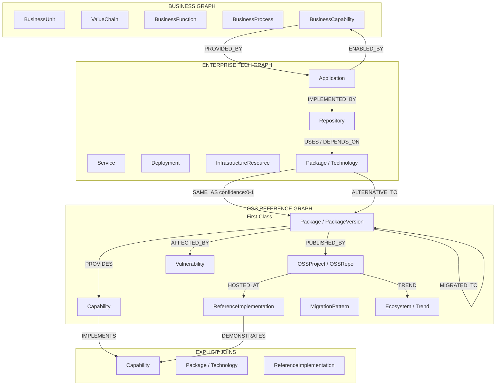

# StackGraph UI Specification — "Evidence-First Triad" (v2)

**Status:** Revised UI concept, incorporating design critique against the Product & Intelligence Specifications (v1, August 2026)
**Supersedes:** "Triadic Intelligence" UI Concept (v1)
**Core thesis, unchanged:** three co-equal graphs — Business, Enterprise, OSS — connected by explicit bridge nodes. OSS is peer intelligence, not enrichment.

---

## Changelog from v1

| # | Change | Why | Reference |
|---|---|---|---|
| 1 | Home screen changed from a live graph canvas ("Triad Explorer") to a scored, filterable dashboard ("Software Estate") | v1 silently replaced the spec's actual V0 home screen; a canvas doesn't deliver the "I didn't know that" reaction the success test requires | Product spec §37.1, §46, §49 |
| 2 | Graph canvas demoted to an opt-in **Explore mode**, entered from a specific node, never the default surface | Force-directed layouts are unreadable past ~150 nodes on any renderer; the estate has 10k+ nodes | Critique §3 |
| 3 | Rendering model changed from "single unified canvas" to "synced panels with linked selection" | v1's rendering rule ("never separate") contradicted its own 30/40/30 column layout | Critique §2 |
| 4 | Agent responses standardized as text summary + evidence citations by default; graph highlight only for traversal-shaped questions | Matches spec §36 ("explain and reason over results"); most example NL questions in the spec aren't graph-shaped | Critique §4, spec §36 |
| 5 | Added an explicit **uncertain bridge** state for low-confidence joins | v1's own worked example lost track of which OSS package a bridge pointed to — a live demonstration of the problem | Critique §5, spec §34 |
| 6 | Confidence notation standardized to categorical (HIGH/MEDIUM/LOW) with the decimal available on inspection | v1 used three different formats (94%, 0.78, HIGH) across the doc and spec | Critique §6, spec §26, §34 |
| 7 | Bridge Pulse restricted to the active selection only; added `prefers-reduced-motion` support; domain badges require text/icon, not color alone | Ambient motion across hundreds of bridge nodes is noise, not signal; color-only category encoding fails for colorblind users | Critique §7 |
| 8 | Renamed "5-Minute Test" → "20-Minute Test" | v1's section heading said 5 minutes; its own body text and the actual spec (§49) both say 20 minutes | Editorial fix |

---

## 1. Data Model (unchanged)

The underlying triadic graph structure is sound and isn't the subject of this revision — the entities, relationships, and bridge concept all correctly express spec §5 and §6.



**Change from v1:** the `PUBLISHES / SAME_AS` edge between `PKG_ENT` and `PKG_OS` now explicitly carries a `confidence: 0–1` attribute. This single change is what makes the uncertain-bridge state (§4 below) possible — in v1 this edge was drawn as a settled fact with no confidence attribute, which is exactly what produced the ambiguity in the original worked example.

---

## 2. UI Design Philosophy — revised

| Principle | v1 | v2 |
|---|---|---|
| OSS is not enrichment | OSS panel always occupies 30–40% of the screen | OSS is one click away from any bridge node, with equal visual weight *when shown* — but it is not forced onto the default view for every persona and every task |
| Joins are visual | Dragging reveals OSS context | Same, plus: a join below the confidence threshold renders as **dashed**, not solid, and is labeled "possible match" |
| Evidence is a layer, not a footnote | Evidence Stack pane | Unchanged — this was correct in v1, keep as-is |
| Time is structural | Global time slider | Unchanged — correct in v1 |
| Agent as translator | "Renders as graph paths, not text" | **Renders as text + citations by default; graph highlight is added only when the question is a relationship/traversal question** (see §3.5) |

**Rendering model (resolves v1's internal contradiction):** StackGraph uses **synced panels with linked selection**, not one physical canvas. Business, Enterprise, and OSS each render in their own panel or drawer; selecting a node in one panel highlights its connections in the others via shared selection state. This is a coordinated-multiple-views pattern, not three isolated tabs — the panels update together, nothing requires a manual switch — but it is honest about being panels, not a single hairball graph. This is also the more buildable version: it maps to standard state management rather than a bespoke 10k-node force-directed renderer.

### Color / Domain System (unchanged palette, added requirement)

- **Business:** Warm amber/gold (`#D4A843`)
- **Enterprise Tech:** Steel / slate (`#4A6FA5`)
- **OSS Reference:** Emerald / teal (`#2A9D8F`)
- **Intelligence / Assessment:** Violet (`#7B5AA6`)
- **Bridge / Shared:** amber glow when a confirmed join is selected; dashed outline, no glow, when unconfirmed

**New requirement:** every domain badge carries a short text label (`ENT`, `OSS`, `BIZ`) or icon in addition to color. Color alone must never be the only signal distinguishing domain — this fails for colorblind users and doesn't survive a black-and-white printout of a dashboard, which CTOs still do.

### Confidence notation (new — standardizes three conflicting formats from v1/spec)

| Label | Range | Where shown |
|---|---|---|
| HIGH | ≥ 0.85 | Primary display everywhere — dashboard badges, recommendation cards, evidence items |
| MEDIUM | 0.60–0.84 | Primary display |
| LOW | < 0.60 | Primary display, with a visually distinct (not just labeled) warning treatment |

The underlying decimal (e.g., `0.71`) is always available on hover or in the Evidence Inspector, never hidden — this satisfies spec §34's requirement that recommendations "not conceal uncertainty" while giving executives a label they can scan in half a second.

---

## 3. The Five MVP Screens

Renamed and reordered to match spec §46 V0 exactly: **Software Estate, Application Explorer, Technology Explorer, Viability Dashboard, Ask Your Estate.** Graph exploration is a mode, not a sixth screen.

### 3.1 Screen A — Software Estate (Home)

**Concept:** the scored, filterable portfolio overview from spec §37.1. This is what a CTO sees in the first 20 minutes.

- **Top strip:** estate-level counts — applications, repositories, services, languages/runtimes distribution, cloud vs. on-prem split.
- **Center:** a ranked, sortable table/card grid — every row is an application or technology with a Viability score, a domain badge, and a confidence label. Default sort: Priority (business importance × viability gap × opportunity × confidence ÷ effort, per spec §31).
- **No graph rendered by default.** Filtering, sorting, and search are the primary interactions — not force-directed layout.
- **Ask your estate** input pinned to the top bar (see §3.5), available from every screen.

Clicking any row opens the Application or Technology Explorer for that item (§3.2, §3.3). Clicking a bridge-eligible field (a package, a capability) inside that explorer is the only way into Graph Explore mode.

### 3.2 Graph Explore mode (opt-in, entered from a node — not a screen of its own)

**Concept:** the "magic" from v1's Triad Explorer, preserved but scoped.

- Entered by clicking a bridge node (Capability, Package, Technology) from any screen.
- Shows a **bounded neighborhood only** — the selected node plus its direct and one-hop connections across Business, Enterprise, and OSS, typically under 50 nodes.
- Beyond that radius, nodes cluster into a labeled aggregate ("+212 repositories using this package") rather than rendering individually — this is the clustering v1 mentioned "initially for OSS nodes" but should apply to *any* domain past the one-hop boundary, enterprise included.
- Panels are still domain-colored and badge-labeled; a confirmed bridge glows amber on selection, an unconfirmed one shows dashed with a "possible match" tag (§4).
- Exit returns to wherever the user entered from — this is a lens on one question, not a separate destination.

**Example walkthrough (unchanged from v1, now correctly scoped):**
1. From the Application Explorer for `Billing API`, the user clicks `Repository: billing-svc → Depends On → Package: axios`.
2. `axios` is a bridge node — clicking it enters Graph Explore, showing only `axios`'s neighborhood: the OSS project, its release cadence, the migration pattern to native `fetch`, and the internal repos using it.
3. The Business layer is reachable from the same neighborhood via `ENABLED_BY`, one hop out — not rendered by default, revealed on request.

### 3.3 Screen B — Application Explorer

Unchanged from v1 in structure (Viability Radar top, node graph center, Evidence Drawer bottom/side) — this screen already correctly operationalizes the evidence-first principle. One correction to the worked example:

**Evidence Drawer — corrected example** (v1's version confused two different packages mid-example; this version uses the spec's actual evidence classes from §33 and resolves the join explicitly):

```
Supportability: 44 — INFERRED (confidence: MEDIUM · 0.71)

DECLARED
 • Dockerfile bases on node:18-alpine — infra/Dockerfile

OBSERVED
 • repo imports request@2.88.2 — src/lib/http.ts (AST import)
 • no uses of native fetch found in this repository

EXTERNAL_MEASURED
 • request package: 0 releases in 38 months, deprecated by maintainer — deps.dev / OSV

INFERRED
 • Node 18 + request together indicate a legacy HTTP stack — pattern match, confidence 0.71
```

Next to `Package: request`, the OSS bridge badge now reads:

```
[OSS bridge: request → HTTP Client — possible match · 0.71]   [Confirm]  [Reject]
```

Dashed border, no glow — because 0.71 falls below the 0.85 confirmed-join threshold. Clicking it opens Graph Explore on the unconfirmed neighborhood; confirming or rejecting the match is itself an action that updates the graph (a small but real piece of the "outcome feedback" loop from spec §50.6).

### 3.4 Screen C — Technology Explorer

Structure unchanged from v1 (Internal Estate pane / OSS Intelligence pane, Recommendation Engine card) — this screen's recommendation card already tracked spec §26's Explain template closely. One formatting fix:

```
RECOMMENDATION: REPLACE request → native fetch
Confidence: HIGH (0.94)

Why
 • equivalent required capability — HTTP Client (capability graph)
 • 72 comparable Node services already use native fetch (enterprise graph)
 • native fetch trending up, request trending down (ecosystem graph)
 • native to Node 18+, already the declared runtime (repo manifests)

Migration
 • 17 call sites, 8 files — estimated LOW complexity

Counter-signals
 • retry semantics differ; integration tests required
```

Confidence is now `HIGH (0.94)` — categorical first, decimal in parentheses — consistent everywhere per §2.

### 3.5 Screen D — Viability & Modernization Dashboard

Unchanged in structure from v1 (Technology Entropy metric, ranked Modernization Opportunities table). This screen already matches the design philosophy best — it's the proof that scored, ranked tables outperform graph canvases for the "what should we do" question, and is the intended template for what Screen A (Home) should feel like on first load.

### 3.6 Screen E — Ask Your Estate

**Response pattern, standardized:**

| Question type | Example | Response |
|---|---|---|
| Evidence / explanation | "Why is Billing's viability score low?" | Text answer + evidence citations. No graph. |
| Ranking / aggregation | "What are our largest modernization opportunities?" | Ranked list, links into Screen D. No graph. |
| Relationship / traversal | "Show all applications indirectly dependent on package X" | Text summary **plus** a Graph Explore highlight of the traversed path |
| Standardization / clustering | "What should we standardize?" | Text summary + capability cluster table; Graph Explore available per cluster, not forced open |

The agent always explains its reasoning in text with citations (spec §36) — a graph highlight is an *addition* for traversal-shaped answers, never a replacement for the text answer.

---

## 4. Key Interaction Patterns — revised

| Pattern | v1 | v2 |
|---|---|---|
| Bridge Pulse | Glows whenever any node connects across domains | Glows only for the **active selection**, and only when the underlying join confidence is HIGH (≥ 0.85). Lower-confidence joins render dashed, no glow. Respects `prefers-reduced-motion`. |
| Co-occurrence View | Mini-chart in Technology Explorer | Unchanged |
| Migration Path Animation | Animated on view | Unchanged, but paused by default under `prefers-reduced-motion` |
| Evidence Inspector | Table of fact_type/classification/source | Unchanged — this is where the confidence decimal lives |
| Time Slider | Global scrub control | Unchanged |
| **Uncertain Bridge** *(new)* | — | Any `SAME_AS` join below 0.85 confidence shows a dashed connector and a "possible match" badge with Confirm/Reject actions, rather than presenting the join as settled |

---

## 5. Technical Stack

Unchanged from v1 with one addition:

| Layer | Choice | Note |
|---|---|---|
| UI Framework | Next.js / TypeScript + React Flow / Cytoscape.js | Now scoped to bounded-neighborhood rendering (Graph Explore mode), not full-estate rendering |
| Graph Visualization | Domain-colored nodes, clustering | **Clustering is now required at the one-hop boundary for every domain**, not just OSS — this is what keeps Graph Explore under ~50 rendered nodes regardless of how large the underlying estate is |
| State / Query | PostgreSQL + AGE via API | Unchanged |
| Agent Layer | LLM + structured function calling | Now returns a typed response object (`{text, citations, graph_highlight?}`) so the UI can render text-first and attach a graph highlight only when present |
| Real-time Updates | SSE / WebSockets | Unchanged |

---

## 6. The 20-Minute Test (renamed; matches spec §49)

Spec §49's actual success criterion: connect a GitHub org with 100+ repos and surface at least five material facts engineering leadership didn't already know, within roughly 20 minutes.

1. User connects a GitHub org.
2. **Software Estate (Home)** loads first — ranked, scored, no graph rendering required to see it. This is what makes the 20-minute window achievable; scanning a sorted table is fast, exploring a 10k-node canvas is not.
3. Within that view, the user sees `axios`, `request`, and `Node 18` flagged with confidence-labeled evidence, without having to open Graph Explore at all.
4. Clicking into `Billing API` shows the Business Capability link, Viability score with evidence, and the recommendation card — Graph Explore is available but optional at every step.
5. Ask Your Estate answers "Which Tier-1 applications use unsupported runtimes?" as a ranked, cited text list, with an optional graph highlight if the user asks a traversal-shaped follow-up.

If the home screen still requires the user to explore a force-directed graph to get their first "I didn't know that" moment, the design has failed the test — that's the bar this revision is built against.

---

## 7. Open questions for the next design pass

- Exact clustering algorithm/threshold for the one-hop boundary in Graph Explore (by degree? by domain count? user-configurable?).
- Whether "Confirm/Reject" on an uncertain bridge should require a permission level (this starts to touch spec §38's approve/execute pipeline, not just display).
- Mobile/responsive behavior for the synced-panel layout below ~1440px — not addressed in v1 or this revision, and likely out of scope for a B2B command-center tool but worth a stated decision rather than silence.
